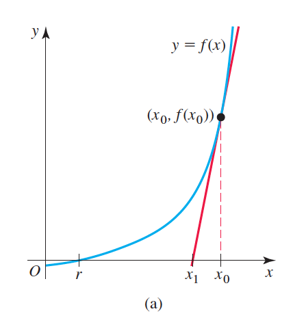
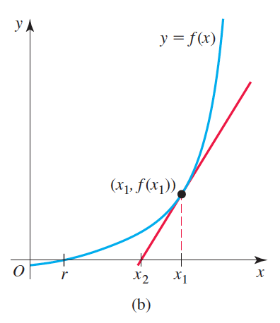
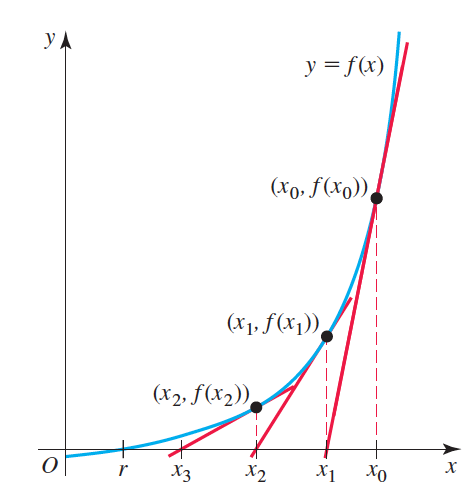
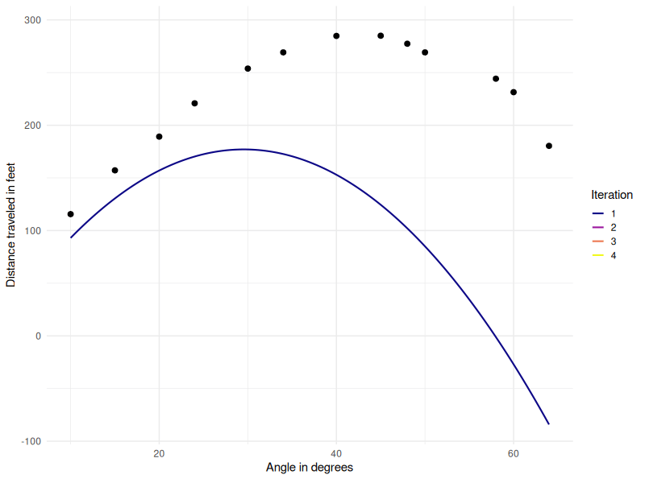

# Finding a root

## Linear

\begin{align*}
	f(x) &= 5-3x = 0 \\
\end{align*}

. . .

\begin{align*}
	x &= \frac{5}{3}
\end{align*}

## Quadratic

\[
	f(x) = 2x^2 +x -1 = 0
\]

. . .

\[
x = \frac{-b\pm \sqrt{b^2-4ac}}{2a}
\]

. . .

\[
x_1 = -1, \quad x_2 = \frac{1}{2}
\]

## Polynomials of higher order?

. . .

\[
f(x) = x^5 -5x +3
\]

. . .

```{r echo=FALSE}
x <- seq(-2, 2, length = 1000)
y <- x^5 - 5*x + 3
plot(x, y, type = "l", ylab = expression(x^5-5*x+3))
abline(h = 0, lty =2)
```

# Newton-Raphson Algorithm

<!--
##

Newton-Raphson Method is a numerical analysis technique for finding a root of a function.

. . .

It involves finding successive tangent lines to the graph of $f$, following a certain algorithm until we get close enough to the root.

# Derive the iteration formula for the Newton-Raphson method

##

1) Draw a tangent line to the curve of $f$ at the point $(x_0, f(x_0))$:

. . .

\[
y - f(x_0) = f'(x_0)(x-x_0)
\]

. . .

2) Continue the tangent line such that it intersects the $x$-axis at a point, call that point $x_1$. $x_1$ is our new approximation:

. . .



## Express $x_1$ as a function of $x_0$

The equation of the tangent line from $\left(x_0, f(x_0)\right)$ is
\[
y - f(x_0) = f'(x_0)(x-x_0)
\]

. . .

Replace $(x,y)$ by $(x_1, 0)$, we get

\[
0 - f(x_0) = f'(x_0)(x_1-x_0)
\]

. . .

\[
x_1 = x_0 - \frac{f(x_0)}{f'(x_0)}
\]

## Repeat steps 1 and 2 for $x_1$



##

1) Draw a tangent line to the curve of $f$ at the point $(x_1, f(x_1))$:

\[
y - f(x_1) = f'(x_1)(x-x_1)
\]

2) Continue the tangent line such that it intersects the $x$-axis at a point, call that point $x_2$. $x_2$ is our new approximation:


Replace $(x,y)$ by $(x_2, 0)$, we get

\[
0 - f(x_1) = f'(x_1)(x_2-x_1)
\]

\[
x_2 = x_1 - \frac{f(x_1)}{f'(x_1)}
\]

## Repeating the algorithm



##

\[
x_3 = x_2 - \frac{f(x_2)}{f'(x_2)}
\]

. . .

\[
\ldots
\]

. . .
-->

\[
x_{n+1} = x_n - \frac{f(x_n)}{f'(x_n)}
\]

## Example 2

```{r echo=FALSE}
# Example 2

# First root

x <- -2
i <- 1
while(i <= 10){
  i <- i + 1
  x.new <- x - (x^5 - 5*x + 3)/(5 * x^4 - 5)
  x <- x.new
}
x1 <- x.new

# Second root

x <- 0
i <- 1
while(i <= 10){
  i <- i + 1
  x.new <- x - (x^5 - 5*x + 3)/(5 * x^4 - 5)
  x <- x.new
}
x2 <- x.new

# Third root

x <- 2
i <- 1
while(i <= 10){
  i <- i + 1
  x.new <- x - (x^5 - 5*x + 3)/(5 * x^4 - 5)
  x <- x.new
}
x3 <- x.new

x <- seq(-2, 2, length = 1000)
y <- x^5 - 5*x + 3
plot(x, y, type = "l", ylab = expression(x^5-5*x+3))
abline(h = 0, lty =2)
points(x1, 0, col = "red", pch = 16, lwd =3)
points(x2, 0, col = "red", pch = 16, lwd =3)
points(x3, 0, col = "red", pch = 16, lwd =3)
```

##

```{r eval=FALSE}
# Example 2

# First root

x <- -2
i <- 1
while(i <= 10){
  i <- i + 1
  x.new <- x - (x^5 - 5*x + 3)/(5 * x^4 - 5)
  print(x.new)
  x <- x.new
}
x1 <- x.new
x1

# Second root

x <- 0
i <- 1
while(i <= 10){
  i <- i + 1
  x.new <- x - (x^5 - 5*x + 3)/(5 * x^4 - 5)
  print(x.new)
  x <- x.new
}
x2 <- x.new
x2

# Third root

x <- 2
i <- 1
while(i <= 10){
  i <- i + 1
  x.new <- x - (x^5 - 5*x + 3)/(5 * x^4 - 5)
  print(x.new)
  x <- x.new
}
x3 <- x.new
x3

x <- seq(-2, 2, length = 1000)
y <- x^5 - 5*x + 3
plot(x, y, type = "l", ylab = expression(x^5-5*x+3))
abline(h = 0, lty =2)
points(x1, 0, col = "red", pch = 16, lwd =3)
points(x2, 0, col = "red", pch = 16, lwd =3)
points(x3, 0, col = "red", pch = 16, lwd =3)
```

## Exercise

```{r echo=FALSE}
# Exercise

x <- seq(0, 10, length = 1000)
y <- x^2 - 10
plot(x, y, type = "l", ylab = expression(sqrt(x)))
points(sqrt(10), 0, col = "red", pch = 16, lwd =3)

x <- 3
i <- 1
while(i <= 10){
  i <- i + 1
  x.new <- x - (x^2 - 10)/(2 * x)
  x <- x.new
}


x <- 2
i <- 1
while(i <= 10){
  i <- i + 1
  x.new <- x - (x^2 - 10)/(2 * x)
  x <- x.new
}

x <- 4
i <- 1
while(i <= 10){
  i <- i + 1
  x.new <- x - (x^2 - 10)/(2 * x)
  x <- x.new
}

```

##

```{r eval=FALSE}
# Exercise

x <- seq(0, 10, length = 1000)
y <- x^2 - 10
plot(x, y, type = "l", ylab = expression(sqrt(x)))
points(sqrt(10), 0, col = "red", pch = 16, lwd =3)

x <- 3
i <- 1
while(i <= 10){
  i <- i + 1
  x.new <- x - (x^2 - 10)/(2 * x)
  print(x.new)
  x <- x.new
}


x <- 2
i <- 1
while(i <= 10){
  i <- i + 1
  x.new <- x - (x^2 - 10)/(2 * x)
  print(x.new)
  x <- x.new
}

x <- 4
i <- 1
while(i <= 10){
  i <- i + 1
  x.new <- x - (x^2 - 10)/(2 * x)
  print(x.new)
  x <- x.new
}

```

## Remark 3

```{r echo=FALSE}
# Remark
x <- seq(-4, 5, length = 1000)
y <- x/(x^2 + 1)
plot(x, y, type = "l")
```

##

```{r eval=FALSE}

# Remark

x <- seq(-4, 5, length = 1000)
y <- x/(x^2 + 1)
plot(x, y, type = "l")

x <- 2
i <- 1
while(i <= 10){
  i <- i + 1
  x.new <- x - (x * (x^2 + 1)/(1 - x^2))
  print(x.new)
  x <- x.new
}


x <- 1/sqrt(3)
i <- 1
while(i <= 10){
  i <- i + 1
  x.new <- x - (x * (x^2 + 1)/(1 - x^2))
  print(x.new)
  x <- x.new
}


x <- 1/2
i <- 1
while(i <= 10){
  i <- i + 1
  x.new <- x - (x * (x^2 + 1)/(1 - x^2))
  print(x.new)
  x <- x.new
}
```

<!--
## Practise

Find the root of $f(x) = x^{3}-5x+1 = 0$

with inital approximations $x_{0} = 1$ with two steps.

. . .

\[
f(x) = x^{3}-5x+1
\]

. . .

\[
f'(x) = 3x^{2}-5
\]

. . .

\begin{align*}
x_{n+1} &= x_n - \frac{f(x_n)}{f'(x_n)}\\
 &= x_n - \frac{x_n^3-5x_n+1}{3x_n-5}\\
\end{align*}

## $x_0 = 1$

\begin{align*}
x_{1} &= 1 - \frac{1^3-5(1)+1}{3(1)^2-5} = -0.5\\
x_{2} &= x_1 - \frac{x_1^3-5(x_1)+1}{3(x_1)^2-5}\\
&= -0.5 - \frac{(-0.5)^3-5(-0.5)+1}{3(-0.5)^2-5}\\
&= 0.2441176471
\end{align*}
-->

# Quadratic Model

##
<!--
## Problem Statement

We aim to model <p class="fragment highlight-red">the distance a baseball travels</p> as a function of <p class="fragment highlight-green">the hitting angle</p> using a quadratic function.

## Model Specification

Let

* $Y_{i}$ denote the random variable for distance traveled by the baseball (in feet) for which the observed value is $y_{i}$.

. . .

* $X_{i}$ denote the random variable of the hitting angle (in degrees) for which the observed value is $x_{i}$
. . .

We consider that the relationship between the distance travelled and the hitting angle is modeled as the quadratic equation:

. . .
-->
$Y_{i} = \alpha + \beta X_{i} + \gamma X_{i}^{2 } + \epsilon_{i},$

. . .

where

. . .

$\alpha,\beta,\gamma$ are the parameters to be estimated, and

. . .

$\epsilon_{i}$ is the error term, assumed to be normally distributed with mean $0$ and variance $\sigma^{2}$, i.e., $\epsilon_{i} \sim N(0, \sigma^{2})$.

## Data

```{r echo=FALSE}
x <- c(10, 15, 20, 24, 30, 34, 40, 45, 48, 50, 58, 60, 64)
y <- c(115.6, 157.2, 189.2, 220.8, 253.8, 269.2, 284.8, 285.0, 277.4,
       269.2, 244.2, 231.4, 180.4)

plot(x, y, xlab = "Angle in degrees", ylab = "Distance traveled in feet", ylim = c(0, 300), xlim = c(0, 80), pch = 16)
```

<!--
## Plots of initial guess

```{r eval=FALSE}
# We use TH.O to store the initial guess
# TH.O = (alpha, beta, gamma, sigma^2)
TH.O <- c(-15, 13, -0.22, 50)
plot(x, y, xlab = "Angle in degrees", ylab = "Distance traveled in feet", ylim = c(0, 300), xlim = c(0, 80), pch = 16)
x.seq <- seq(min(x), max(x), length = 1000)
y.seq <- TH.O[1] + TH.O[2] * x.seq + TH.O[3] * x.seq^2
points(x.seq, y.seq, type = "l", col = 2, lty = 1, lwd = 2)
```

##

```{r echo=FALSE}
# We use TH.O to store the initial guess
# TH.O = (alpha, beta, gamma, sigma^2)
TH.O <- c(-15, 13, -0.22, 50)
plot(x, y, xlab = "Angle in degrees", ylab = "Distance traveled in feet", ylim = c(0, 300), xlim = c(0, 80), pch = 16)
x.seq <- seq(min(x), max(x), length = 1000)
y.seq <- TH.O[1] + TH.O[2] * x.seq + TH.O[3] * x.seq^2
points(x.seq, y.seq, type = "l", col = 2, lty = 1, lwd = 2)
```

## Initialization

```{r}
x.seq <- seq(min(x), max(x), length = 1000)

n <- length(x)
sum.y <- sum(y)
sum.x <- sum(x)
sum.x2 <- sum(x^2)
sum.x3 <- sum(x^3)
sum.x4 <- sum(x^4)
sum.xy <- sum(x*y)
sum.x2y <- sum((x^2)*y)
sum.x3y <- sum((x^3)*y)

TH.N <- rep(0, 4)
```

## Iteration

```{r eval=FALSE}
plot(x, y, xlab = "Angle in degrees", ylab = "Distance traveled in feet", ylim = c(0, 300), xlim = c(0, 80), pch = 16)
r <- 1
repeat{

cat("Number of iteration\n", r, "\n")
cat("Estimates\n", TH.O, "\n\n\n")

y.seq <- TH.O[1] + TH.O[2] * x.seq + TH.O[3] * x.seq^2
points(x.seq, y.seq, type = "l", col = r, lty = 1, lwd = 2)
Sys.sleep(5)
r <- r + 1

alpha <- TH.O[1]
beta <- TH.O[2]
gamma <- TH.O[3]
sigma2 <- TH.O[4]

SSR <- sum((y - alpha - beta * x - gamma * x^2)^2)
G.a <- (sum.y - n* alpha - sum.x * beta - sum.x2 * gamma)/sigma2
G.b <- (sum.xy - sum.x * alpha - sum.x2 * beta - sum.x3 * gamma)/sigma2
G.t <- (sum.x2y - sum.x2 * alpha - sum.x3 * beta - sum.x4 * gamma)/sigma2
G.s2 <- -n/(2*sigma2) + (1/(2 * (sigma2^2))) * SSR

H.aa <- -n/sigma2
H.ab <- -sum.x/sigma2
H.at <- -sum.x2/sigma2
H.as2 <- (-1/sigma2^2) * (sum.y - n* alpha - sum.x * beta - sum.x2 * gamma)
H.bb <- -sum.x2/sigma2
H.bt <- -sum.x3/sigma2
H.bs2 <- (-1/sigma2^2) * (sum.xy - sum.x * alpha - sum.x2 * beta - sum.x3 * gamma)
H.tt <- -sum.x4/sigma2
H.ts2 <- (-1/sigma2*2) * (sum.x2y - sum.x2 * alpha - sum.x3 * beta - sum.x4 * gamma)
H.s2s2 <- (n/2*(sigma2^2)) - (1/(sigma2^3)) * SSR

G <- c(G.a, G.b, G.t, G.s2)
H <- matrix(c(H.aa, H.ab, H.at, H.as2,
              H.ab, H.bb, H.bt, H.bs2,
              H.at, H.bt, H.tt, H.ts2,
              H.as2, H.bs2, H.ts2, H.s2s2),
              ncol = 4, byrow = T)
TH.N <- TH.O - solve(H) %*% c(G)

ifelse((abs(TH.N[1] - TH.O[1]) < 0.0001) && (abs(TH.N[2] - TH.O[2]) < 0.0001) && (abs(TH.N[3] - TH.O[3]) < 0.0001) && (abs(TH.N[4] - TH.O[4]) < 0.00001), break, TH.O <- TH.N)
}
```
-->

## Result


